> **16 September latest operator stop gate — this testing round:** Get the independently hosted live site and installed Tauri skeleton working, then explicitly report **READY FOR TESTING** and stop this implementation round. Provide the site/download links, what was actually tested, known limitations and a short tester checklist. The skeleton must launch the real UI, connect to the existing native worker and exercise an available end-to-end path with honest CPU/provider status; native GPU stubs must not be presented as working acceleration. Do not wait for, start or continue the remaining native GPU backend implementation/qualification campaign before this handoff. Preserve existing work and record native GPU coverage as required follow-up, then await the operator's post-testing instruction to resume. This supersedes earlier instructions to continue automatically from the live-site milestone into all desktop backends or to finish the entire support matrix in this round. “Ready for testing” is a limited candidate handoff, not release qualification or completion of the overall product requirements. The operator has explicitly deferred that remaining work to conserve this round's budget.

> **16 September native desktop GPU requirement and sequencing:** Get the independently hosted live browser site working first; desktop GPU may remain an explicitly labelled skeleton for that milestone. Stop for the testing handoff before further backend implementation; after the operator resumes work, implement and package actual native GPU backends with a reviewed Apple/NVIDIA/AMD/Intel and OS/architecture coverage matrix. Native GPU remains mandatory to complete the overall task, independent of browser/WebView GPU support; CPU-only packages or detection stubs do not satisfy it. Require installed-artifact GPU evidence, complete seed/photo/morph workflows, provider reporting, safe CPU fallback and the existing Oliver/Manjaro gate. See [mandatory desktop GPU delivery and scheduled follow-up](web_checkface_delivery_plan.md#native-desktop-gpu--mandatory-first-class-delivery-requirement-16-september).

> **16 September whole-pipeline autoresearch:** Every processing stage is in research scope, including local alignment, actual e4e, synthesis, morphs, caching, export and CPU/GPU recovery on phones and desktops. Historical synthesis-only results are not a rule excluding e4e. Experimental admission must allow bounded synthetic-fixture runs to gather missing product evidence; product qualification remains evidence-based. See [research policy](autoresearch/program.md#whole-pipeline-research--operator-clarification-16-september).

> **16 September hosting independence:** `next.facemorph.me` and the eventual production successor must have no dependency on the operator's local TrueNAS, home network or computer, including assets, downloads and optional diagnostic collection. A local origin behind Cloudflare Tunnel is transitional, not an accepted completed deployment. Labs should also be independent; only a minimal documented temporary TrueNAS component is permitted if necessary, never as a product dependency. See [hosting requirements](web_checkface_delivery_plan.md#hosting-independence--16-september-operator-clarification). This supersedes earlier conflicting hosting directions; it does not authorize infrastructure changes.

> **16 September photo-tile UX requirement:** Empty face tiles/“+” must open the photo picker on click/tap or keyboard activation, and face tiles must accept an image drop. Successful selection switches the targeted face to Photo and uses the shared validation/e4e workflow. Include accessible, drag-over, cancellation, invalid-file and busy-state behavior in handoff checks. Implementation is pending; see [handoff acceptance](web_checkface_delivery_plan.md#friends-and-family-handoff--definition-of-done-for-this-run).

> **16 September handoff outcome:** This run must deliver the integrated, publicly reachable friends-and-family candidate with usable connected workflows, actual desktop downloads and optional automatically saved debug reports. Portable setup is included; disconnected demos do not complete the phase. See [handoff acceptance](web_checkface_delivery_plan.md#friends-and-family-handoff--definition-of-done-for-this-run).

> **16 September CI test-selection decision:** Routine CI tests active shipping artifacts and meaningful regressions, using dependency-aware triggers. Abandoned research candidates are excluded from deployment jobs; heavy inference/performance work reruns only when relevant or explicitly requested. Preserve full initial qualification and honest artifact-bound evidence. See [purposeful test policy](web_checkface_delivery_plan.md#purposeful-ci-and-research-test-selection--16-september-decision).

> **16 September CI/CD decision:** Adapt the existing pipelines and autoresearch runners to test the real browser bundles, installed desktop packages and Docker image digests. Promote the same verified artifacts; source/unit checks and package startup alone do not close workflow gates. See [artifact testing contract](web_checkface_delivery_plan.md#cicd-tests-the-deliverable-artifacts--16-september-decision).

> **16 September first-candidate scope:** All web platforms and Windows/macOS/Linux desktop across architectures are required in this phase, with actual e4e and the agreed pairwise/full-smooth figure-eight and ellipse modes. Arbitrary user-defined morph functions are excluded. Platform/workflow gaps block phase completion; interim evidence-gathering builds do not satisfy it. See [governing scope](web_checkface_delivery_plan.md#first-candidate-scope--operator-requirement-16-september).

> **16 September sharing decision:** The successor shares actual image and morph-video files, with native file sharing where supported and save/download alternatives. Replace generated-result copy-link UI; keep editable project export separate and preserve historic links independently. See [sharing requirements](web_checkface_delivery_plan.md#share-the-actual-image-or-morph--16-september-decision). Implementation and device acceptance remain pending.

> **16 September static-assets investigation:** [Read-only Triton measurements](review-artifacts/static-assets-2026-09-16/README.md) distinguish the small curated image collection from bulk preservation. Names requests lowercase the uppercase catalogue before hashing; retain that exact mapping. Existing full-size WebP/JPEG artifacts are not canonical lossless originals. No publication or live changes performed.

> **16 September fresh-eyes review:** Read [pre-delegation findings and required handoffs](predelegation_review_2026-09-16.md) before assigning work. The current authority is the governing delivery plan plus dated closeout decisions and linked contracts. Historical HF hosting/authentication tasks, old device-status snapshots and superseded open questions are not current work orders. Preservation and the useful 28-day comparison still apply.

> **16 September mobile CI:** Android Chrome emulator and iOS Safari Simulator component jobs passed seven browser checks each on `candidate/mobile-ci-20260916` (`094d5cb`), [CI run 35055511127](https://github.com/check-face/facemorph.me/actions/runs/35055511127). See [scope and extension plan](facemorph.me/tests/mobile/README.md). They exercise actual browser cache/worker/image APIs; inference/e4e and integrated app workflows remain separate required follow-up. Emulation cannot satisfy physical-device performance/memory or photo release gates.

> **16 September e4e release gate:** [Required photo coverage](release-tests/PHOTO-COVERAGE.md) is enforced for every browser, desktop and self-host target. Browser/desktop also require an independently evidenced photo CPU fallback after GPU absence/loss. Structured encoder, reference, provider and full-workflow evidence is mandatory; synthesis-only or boolean-only photo claims do not pass. Actual mobile e4e implementation/qualification remains open.

> **16 September closeout decisions:** See [delivery closeout](delivery_closeout_2026-09-16.md): `next.facemorph.me` is the product preview; `labs.facemorph.me` is approved for temporary research. Product debug reporting is opt-in through contextual error/help UI, never a blanket consent banner. Release, preservation and scoped cutover gates remain intact.

> **16 September broad research campaign:** [25 synthesis/e4e proposals and benchmark contract](autoresearch/benchmark-campaign-v2/README.md) now separate actual encoder evidence, synthesis and complete workflows. Physical-phone e4e remains unqualified; CPU synthesis CI is not photo evidence. Larger-memory candidates are included. Packaging and the separate candidate site can proceed in parallel using explicitly pinned bundles; new proposals and metadata tests are not executed inference or release qualification.

> **16 September preview address approved:** Use **`https://next.facemorph.me`** for the integrated successor candidate alongside classic. See the [delivery plan](web_checkface_delivery_plan.md). Deployment and verified public invitation remain separate evidence gates; the address approval starts no trial clock.

> **16 September iPhone reality check:** [Latest diagnostics and feature readiness](iphone_optimisation_reality_check_2026-09-16.md) confirm no new saved runs on refresh. Optimise fast reliable inference, not minimum memory:384 MiB is an experimental control, and larger working sets must be evaluated for measured benefit. Feature integration can proceed now; physical iPhone speed/reliability and full-workflow gates remain open. Oliver’s Manjaro test is excluded from this assessment, not substituted by another result.

> **15 September executable release tests:** The [release test framework](release-tests/README.md) maps the complete browser, Docker, desktop, UX, photo/video, caching, recovery and N-point morph requirements to versioned acceptance scenarios. Component passes support development; missing integrated target evidence blocks RC qualification. Candidate and public-trial/cutover gates remain distinct.

> **15 September release-readiness audit:** [The cross-platform evidence audit](release_readiness_audit_2026-09-15.md) maps research, CPU CI, photo/video, recovery, distribution and parallel-site evidence to release gates. Component feasibility is demonstrated; full-matrix RC qualification and the integrated public trial remain open. This does not change scope or authorize rollout.

> **Confirmed direction — 14 September 2026:** Hugging Face is excluded from the target architecture, including hosting, sign-in and inference. HF proposals below are historical only. Follow the [concise delivery plan](web_checkface_delivery_plan.md), including extensible figure-eight, ellipse and custom multi-face morphs. Preservation and the 28-day comparison gate remain in force.

# facemorph.me Sunset And Preservation Migration Plan

> **15 September e4e coverage requirement:** Every browser/native CPU/GPU photo route now requires actual alignment/e4e/reconstruction/cache/recovery evidence for its OS, architecture and runtime. Synthesis-only and MP4-encoding passes do not establish photo support. See the [delivery plan](web_checkface_delivery_plan.md#e4e-coverage-on-every-path--15-september-clarification) and research coverage registry; many browser/mobile/native photo routes remain pending.

> **15 September executable delivery follow-up:** Windows/Linux real full-model CPU CI is required alongside desktop packaging/install/startup checks; macOS may remain locally qualified for now. Parallel source changes add browser model-asset retention and self-host CPU limits/lossless originals. Linux self-host inference/cache/restart checks and Windows/Linux native full-model CPU CI have passed. Browser model-cache compilation and 16 isolated tests passed; product wiring remains open. These are candidate validation results, not completed releases. See [CI execution and GPU-host assessment](desktop_ci_and_gpu_validation.md). GPU host inspection was read-only; Oliver's Manjaro native GPU gate remains open.

> **15 September model retention:** The [persistent model/runtime cache contract](checkface/docs/model-asset-cache.md) now explicitly requires cross-version content-addressed reuse, durable browser/native/self-host storage, long-lived CDN/HTTP caching, incremental/resumable acquisition and no routine model-cache purge on upgrades. Retained model bytes and runtime qualification are separate. Browser eviction cannot be prevented absolutely; recovery and per-target verification remain required.

> **15 September CPU baseline:** The operator confirms CPU fallback across the full planned browser/native support matrix, with GPU acceleration where qualified. CPU gaps require implementation and testing; slow-but-correct devices may continue locally. Hard limits remain explicit and do not waive correctness checks. Oliver's Manjaro native GPU gate remains required. See the [delivery plan](web_checkface_delivery_plan.md) and [Opus review with corrections](review-artifacts/opus-plan-review-2026-09-15/README.md).

> **15 September Manjaro desktop gate:** A capable computer whose browser GPU path fails is a primary native-app recommendation case. The [desktop gate](web_checkface_delivery_plan.md#required-independent-desktop-gate--oliver-on-manjaro) now explicitly requires Oliver to install the candidate on Manjaro and verify real native GPU inference, workflows and update/recovery. CPU-only success or Docker CI cannot satisfy it. This evidence remains pending.

> **15 September full public archive clarification:** Preserve all verified seed/hash-generated cached images from active and historical Triton caches, excluding e4e/upload-derived and unresolved content. Enumeration, bulk download and mirroring are welcome. The [repo runbook](checkface/docs/public-cache-preservation.md) defines classification, export/verification, free-tier assessment, portable backups and independent secure maintenance by Chris and Oliver. This supersedes earlier curated-only and anti-enumeration scope; execution evidence remains pending.

> **15 September device-guidance clarification:** The [delivery plan](web_checkface_delivery_plan.md#device-guidance-and-persistent-help--15-september) now requires context-sensitive computer/native-app guidance, permanent performance FAQ help and optional locally remembered dismissible usage suggestions. Preserve the existing main-site visual style; the earlier broad redesign permission is superseded. Names retains its stricter identical-appearance/behavior requirement. Guidance and FAQ copy are specified, not yet implemented.

> **15 September cache/names clarification:** The [product contract](inference_learnings.md#15-september-2026--cache-lookup-before-local-generation) now specifies fast concurrent local/hosted cache lookup before local generation, retaining generated lossless 1024px originals locally. Every names-catalogue entry is required in the cache; `names.facemorph.me` must retain identical appearance and behavior, including styles and embedding. Baseline capture and regression evidence are required before claiming preservation complete.

> **15 September reality check:** [Current usage and closeout assessment](reality_check_2026-09-15.md) records refreshed read-only counters, the 5,055-name public catalogue's legacy API dependency, and a bounded Cloudflare synthetic-cache option. The operator confirms the goals plus agreed feedback and morph tuning, with honest communication of removed functionality. Names preservation is now explicit; public-cache exclusions do not waive private historic preservation or the 28-day gate.

> **15 September finish-line clarification:** The [governing delivery plan](web_checkface_delivery_plan.md#finish-line-and-trial-diagnostics--15-september-clarification) now explicitly requires a frozen qualified experiment baseline, an integrated separate candidate site, broad testing/debugging and optional user-reviewed **Send logs to developer** reporting before cutover. These are acceptance requirements, not completed implementation; the 28-day comparison and preservation gates remain in force.

> **14 September 2026 governing delivery plan:** [Web CheckFace and FaceMorpher delivery phases](web_checkface_delivery_plan.md) consolidates the current browser-first direction, existing F# / Fable / Elmish / React frontend requirement, independent Docker API workstream, desktop app with GitHub Releases and built-in updater, and final scoped cutover. It supersedes the older HF-first phase ordering below; preservation and the minimum 28-day public comparison remain gates. CPU and multi-device GPU testing are underway; WebGL and WebGPU require separate qualification. Only CheckFace/FaceMorph API and morph-service redirection or explicitly approved stops are in scope. **No other Triton services or host reconfiguration are in scope.**

> September 2026 review: see [HF architecture and GTX 1080 retirement review](hf_architecture_review_2026-09-08.md) for current platform research, read-only runtime findings, user access design, and proof gates. This April plan is historical; the live site now names 25 October 2026 AEST. No cutover has been performed by the September review.

Date: 2026-04-17

## Current execution status — 14 September 2026

**Co-maintainer review follow-up — updated 15 September:** Configurable bounded CPU threads and persistent lossless originals are implemented and passed Linux amd64 inference/cache/restart CI. Separate desktop CI passed Windows/Linux native CPU checks and Windows/Linux/macOS package startup checks. Browser loading/progress/explicit Generate, gallery polish, optional GPU, complete desktop runtime/UI integration and updater qualification remain open. Preserve the existing visual style under the 15 September direction. See the [current execution report](desktop_ci_and_gpu_validation.md); these candidate results do not establish release readiness.

**Full API compatibility candidate complete:** The source branch [`candidate/self-host-api`](https://github.com/check-face/checkface/tree/candidate/self-host-api/self-host), commit `aba2e31`, now reuses the deployed Flask routes and original Elmish UI, with CPU inference, photo encoding, GUID/cache persistence and all retained media formats. Local Linux arm64 checks, browser workflows and [clean Linux amd64 CI](https://github.com/check-face/checkface/actions/runs/34820566976) passed. Historic byte parity, production data restore, GPU packaging and release artifacts are not claimed. Only source was published; Triton remains unchanged. See [full candidate evidence](review-artifacts/delivery-candidate/README.md). New API features are deferred.

**Earlier minimal build proof (superseded by full compatibility above):** The public source branch [`candidate/self-host-api`](https://github.com/check-face/checkface/tree/candidate/self-host-api) now builds a modern CPU API from a fresh clone, acquires the checksum-pinned official checkpoint through an explicit research/evaluation setup step, and passes real inference on local Linux arm64 and [Linux amd64 CI](https://github.com/check-face/checkface/actions/runs/34811363660). Commit `8496b4c` includes responsive health checks and bounded concurrent requests. It supports seed/text PNGs and linear morph frame ZIPs; uploads, MP4, legacy/GUID compatibility, GPU and custom modes remain separate work. No release, container image or model weights were published, and no live route changed. See [candidate validation](review-artifacts/delivery-candidate/README.md).

**Frontend/desktop source validation:** The existing Fable project compiles with explicit z/w/w-plus runtime/project contracts; 58 .NET and 44 emitted-JavaScript checks pass. Desktop source compiles and passes native31/three-frame, transport/recovery, metadata and own-app/shared-Elmish startup checks. This is development-source validation, not a signed installer, production runtime admission or a verified GitHub release-to-release update. Public product integration and release gates remain open.

**Expanded research and admission policy:** Research now explicitly covers browser
and packaging-independent native CPU/GPU paths for macOS/Windows/Linux and device
architectures, including additional S21 candidates. User generation must wait for
capability checks and on-device reference canaries on a release-qualified route;
invalid GPU output requires independently qualified CPU fallback or desktop
transfer. Correct-but-slow devices get time estimates and desktop guidance. See
[research framework](autoresearch/program.md) and the governing delivery plan.
This requirement does not assert current product integration or universal support.

**14 September device experiment deployment:** The operator authorized a temporary, separate browser-performance lab, now hosted in its own TrueNAS containers with HTTPS ingress and persistent automatic run reports. This is not the HF community trial or a production cutover. The first Samsung-labelled report rejects the Mac-winning JSEP/WGSL implementation on numerical correctness; its timing cannot establish a qualified mobile path. The lab now saves device/browser diagnostics automatically, and a tiled GPU candidate passes seven correctness fixtures with an enforced 128 MiB binding cap on the Mac (about 267 ms/face). Its actual Samsung rerun remains pending; the Samsung CPU fallback passed all 31 fixtures. See [device lab instructions](facemorph.me/experiment/device-lab/README.md) and the continuing [research log](browser_onnx_research_log.md). Preservation, public comparison, retirement and Triton gates are unchanged.

**13 September research round 6:** Complete Burn/WebGPU 1024px synthesis now passes a one-fixture numerical check with autotuning disabled (182 RGB channels differ by one from ONNX). Warm execution is 3.15–3.23 s, so it establishes correctness feasibility rather than a performance benefit. Autotuned execution remains invalid; see the [research log](browser_onnx_research_log.md). Preservation and rollout gates are unchanged.

**13 September research round 5:** Fresh GPU profiles, exact resampling/pixel/Lanczos kernels, bounded H.264 pipeline and mixed-resolution batches are recorded in the [research log](browser_onnx_research_log.md). Eligible style-mix prefix caching reaches 279 ms/face with all 26 full-float outputs exact; ordinary morphs do not qualify for that cache. A temporary HTTPS phone benchmark now covers 31 cases with GPU/CPU paths, but a second-device result remains pending. These are local research outcomes, not UX integration or changes to preservation, trial, retirement or deployment gates.

**13 September optimization follow-up:** Further FP32 synthesis experiments produced a paired 357 → 346 ms/face GPU candidate and verified CPU-only WASM execution, including automatic single-thread fallback without cross-origin isolation (5.35 s/face on this machine). GPU and CPU favor different graphs. Cross-device support and the 0.2–0.3 s browser target remain unproven. See the continuing [research log](browser_onnx_research_log.md). No preservation, trial, retirement or rollout gates changed.

**13 September browser performance target:** Native PyTorch/Metal measures 0.229–0.241 s per full-1024px face. Profile-guided FP32 ONNX rewrites now reach 0.415 s/face in a three-repeat benchmark (paired simplified baseline 0.584 s); a separate earlier run reached 0.395 s. Checked first/last outputs are bit-identical. Batches 2/4 and bounded pipelining did not improve useful throughput. Custom WGSL output conversion takes ~0.6 ms and reduces full-size readback from 12 to 4 MiB. Burn/CubeCL layer and full-model candidates encountered numerical failures and establish no speed win. The 0.2–0.3 s browser target remains open. A LAN harness now lets other machines execute on their own WebGPU, with isolated reports and browser secure-context setup. See [profile-guided report](review-artifacts/browser-onnx-throughput/report.md) and [plan learnings](browser_onnx_plan.md). These local experiments do not change preservation, trial or retirement gates.

**13 September video workload benchmark, corrected:** Code Insiders WebGPU generates 26 unique full-1024px faces in 13.70 s with CPU readback or 13.52 s retaining GPU output. Batch 1 is fastest; batches 2 and 4 are slower. Earlier GPU-output measurements waited on a separate device and are superseded by this run using ORT's actual queue. GPU activity and output residency are verified; mapping, processing and video encoding are excluded. See [benchmark report](review-artifacts/browser-onnx-video/report.md). This is local performance evidence, not a production rollout or completed video-export workflow.

**13 September browser e4e proof:** The operator-authorized photo round trip now runs deployed e4e and 1024px synthesis in Code Insiders on a verified non-fallback Apple/Metal WebGPU device. Encoding takes 1.743 s (65 GPU submissions), reconstruction 0.647 s (50 submissions), excluding model loading and local CPU alignment. The synthetic fixture differs from the converted CPU reference in 261 RGB channels (max 1); this is not legacy parity. Original dlib alignment/preprocessing remains local CPU, so the entirely browser-only upload workflow is not complete. See [browser e4e report](review-artifacts/browser-onnx-e4e/report.md). No production or retirement changes.

**13 September browser ONNX phase 1:** Seed-0 full 1024px synthesis completed locally in Code Insiders using ONNX Runtime Web/WebGPU and separate mapping/synthesis models. The preserved JPEG is not byte-identical; legacy pre-JPEG pixels are unavailable, and candidate JPEG processing still uses host Pillow. See [phase 1 report](review-artifacts/browser-onnx-phase1/report.md). The operator subsequently accepted browser-generation feasibility and authorized the next local end-to-end workflow experiment; exact byte parity remains unproven. Native 1024px API JPEG/WebP references are now recorded. Preservation, public trial and retirement gates are unchanged.

**11 September cache archaeology:** Read-only SSH found a separate
`/mnt/unit/checkfacedata-oldSeeds` archive with 16,406 seed JPEGs plus other media
directories. It is outside the current API container's cache mount and must be
included in preservation inventory. Its archived `hello` closely matches the
converted deployed StyleGAN2 generator; this does not establish StyleGAN1 survival.
See [cache findings](review-artifacts/triton-cache-history-2026-09-11/findings.md).
Numeric-seed requests to the current API do not necessarily retrieve this separate
archive. No live files or deployment settings were changed.

**Authorized cache-proof follow-up:** Full oldSeeds inventory totals 61,033 files
and 2.76 GB. Forty archived seed samples and five active seed samples all closely
match StyleGAN2. Origin API probes verified four cache hits and regenerated old
`hello` on a confirmed miss; the result is almost pixel-identical to the archive.
That probe created one active JPEG, with no archive or deployment changes.
The archive also contains 35 full-hash images and one GUID image, so it requires
content classification before public release. No tested sample established
StyleGAN1 survival; whole-corpus model classification remains incomplete.

**11 September encoder proof:** The existing trial branch now includes a separate
local e4e CPU diagnostic: `python3 scripts/local-encoder.py` in `facemorph.me`,
http://127.0.0.1:7863. Exact deployed e4e and landmark weights were copied read-only
and checksum-verified. Browser upload, face alignment, encoding and reconstruction
through the converted production generator succeeded on the Mac CPU. Two synthetic
reference faces passed repeatability checks, as did the deployed no-face fallback.
See `facemorph.me/docs/review/e4e-cpu/`. This is not production-parity proof or an
integration of uploads/GUIDs into the original trial workflow. Deployment is unchanged.

**Local-first operator update:** Build and review with the co-maintainer before worrying about deployment. The authoritative experiment source now lives inside `facemorph.me/experiment/hf/` on `codex/hf-community-trial`. Run `python3 scripts/local-review.py` from that repository. Its draft banner, transition page and demo free/paid/exhausted account states are all local. The local renderer uses the Mac CPU; no HF credentials are needed for this review. See `facemorph.me/HF_TRIAL.md` and `facemorph.me/docs/side-by-side-trial.md`.

The operator has authorized a working HF spike and a separate, side-by-side community trial. The earlier HF trial execution plan is [Facemorph's next chapter: side-by-side trial](side_by_side_trial_plan.md), with factual deployment state in [trial-status.json](trial-status.json).

The project is entering a primarily archival phase: preserve existing work, offer bounded new generation, and explain local alternatives. Run classic and the new experience together for at least 28 days after the public invitation is verified live. Host the trial in its own HF Space first; `new.facemorph.me` can be a friendly redirect later. Never publish a dead trial link.

The public API retirement target is **25 October 2026 AEST**. June dates and the older phase sequence below are historical context, superseded by the trial plan. No automatic shutdown is authorized. Preservation and an explicit retirement rehearsal still gate removing the old GPU services.

The trial must reuse the existing `check-face/facemorph.me` frontend (branch `codex/hf-community-trial`), with Gradio only as the HF authentication/compute backend. A standalone replacement UI is superseded. The current spike converts the deployed checkpoint, includes a small verified synthetic archive sample, and implements word/seed faces and short morphs. It does not yet migrate photo uploads, GUID links or the full archive. Local tests are not proof of HF deployment; consult trial-status.json for the actual state.

## Purpose

The operating goal is not "turn it off and lose it."
The goal is:

- preserve the ability to reproduce or serve historic checkfaces that users already rely on
- reduce the ongoing GPU, driver, and container maintenance burden on `triton`
- move toward a lower-cost end state where users can keep using the service in some form without this server remaining on permanent CheckFace duty
- give users time to test a replacement surface and tell us what matters before anything is removed
- document a realistic self-hosting or local-use path for the older stack if we can no longer justify operating it ourselves

## Desired End State

The intended end state is:

- `triton` is no longer in the critical path for public CheckFace or facemorph.me traffic
- historic artifacts that matter are archived and can be served or reproduced in a documented way
- the public site is cheap to host, ideally as a static or mostly-static frontend
- any live generation that remains is explicit about limits, slower where necessary, and likely gated by Hugging Face authentication or an equivalent low-cost surface
- the public API on `api.facemorph.me` is retired from its current Triton-hosted form and either:
  - replaced by a Hugging Face-backed path
  - replaced by a thin compatibility layer
  - or reduced to a smaller preservation-oriented surface
- users who need the old workflow have documentation that explains what changed and what local/self-host options still exist

## Constraints And Guardrails

- Do not promise exact parity until it is proven.
- Do not retire `triton` from CheckFace duties until archive/export work is complete.
- Do not announce a final API shutdown sequence until compatibility options have been tested.
- Prefer preservation over redesign.
- Prefer serving verified historic artifacts over re-generating them from a supposedly equivalent environment.
- Separate "public communication" from "backend certainty" so the documentation can move before every technical unknown is settled.

## Historical April migration overview (superseded phase ordering)

```mermaid
flowchart LR
  A[Today: facemorph.me and api.facemorph.me on Triton] --> B[Phase 0: Inventory and freeze]
  B --> C[Phase 1: Public documentation and Learn More page]
  C --> D[Phase 2: Historic hash and cache archaeology]
  D --> E{Can exact legacy results be preserved from cache and manifests?}
  E -->|Yes| F[Archive exact legacy corpus]
  E -->|Partly| G[Document gaps and fallback rules]
  F --> H[Phase 3: Hugging Face auth and backend prototype]
  G --> H
  H --> I{What survives of the public API?}
  I -->|Compatibility layer| J[Thin adapter over HF or archive paths]
  I -->|Smaller replacement| K[Archive plus HF-native endpoints]
  J --> L[Phase 4: testing.facemorph.me rollout]
  K --> L
  L --> M[Phase 5: Production transition]
  M --> N[Phase 6: Triton removed from CheckFace duties]
  N --> O[Archive docs and local or self-host notes]
```

Rendered artifacts for this plan should live alongside the existing diagrams in:

- `diagrams/checkface-hf-retirement-phases.mmd`
- `diagrams/checkface-hf-retirement-phases.png`
- `diagrams/checkface-hf-retirement-phases.svg`

## Current-State Snapshot

This section reflects the initial inspection performed on 2026-04-17.

- Local working copies now live in this workspace at:
  - `checkface`
  - `facemorph.me`
- GitHub repos:
  - `check-face/checkface`
  - `check-face/facemorph.me`
- Live deployment target is the separate `triton` compute host, not the TrueNAS appliance.
- The live checkface API appears to run from the `checkface` repo's server compose project on `triton`.
- `server-api-1` is the main API container.
- `server-encoderapi-1` is the encoder4editing sidecar/API surface.
- Persistent generated media is mounted from `/mnt/unit/checkfacedata` into `/app/checkfacedata`.
- The live server compose metadata points at `/home/oliver/repos/checkface/src/server/docker-compose.yml`.
- The site repo already has an existing explanation and FAQ surface via `src/Explain.fs` and `src/explain.md`.
- The site repo currently advertises `checkfaceml@gmail.com` as the contact address.

### 2026-04-20 Live Verification Update

Read-only verification on 2026-04-20 clarified the current production split:

- `facemorph.me` is currently served by Vercel, not by `triton`.
- `checkface.facemorph.me/api` is currently served by GitHub Pages and still documents the API as open and unauthenticated.
- `api.facemorph.me` is still live behind Cloudflare and proxies to the Triton-hosted `server-api-1` container.
- The homepage retirement banner and `/retirement` page are live, so the public communication work is partially deployed already.
- `testing.facemorph.me` does not currently resolve publicly, so the planned testing surface is not live yet.
- The live backend stack on `triton` is not cleanly sourced from one checkout:
  - `server-api-1` compose metadata points at `/home/oliver/repos/checkface/src/server`
  - `server-encoderapi-1` and `server-db-1` compose metadata point at `/home/chris/repos/checkface/src/server`
- The live `server-api-1` image was created on 2023-02-10.
- The live `server-encoderapi-1` and `server-db-1` containers were created on 2022-03-10.
- The live `/home/chris/repos/checkface` checkout is at commit `4808e39`, which is behind the current local workspace repo head `cc8edfc`.
- Recent live logs show cache-hit serving for `api/face` and `api/mp4`, and successful recent traffic through `api/encodeimage`.
- Mongo `test` currently contains collections `latents`, `encodedimages`, and `uploadedImages` with estimated counts of about 2,034,307, 2,033,588, and 66 respectively.
- Sample `latents` documents confirm mixed historical shapes: older binary `_id` values alongside newer UUID-string records.

These findings do not change the preservation-first strategy, but they do narrow the current reality:

- Phase 1 is partly done in production.
- Phase 2 has enough evidence to move from speculation into reproducible archaeology.
- Phase 4 is not started in any public sense because the promised testing hostname is still absent.

## Known Technical Clues

- `checkface` currently uses StyleGAN2 for its main text-to-face path.
- The server code registers uploaded-image latents in Mongo under `db = client.test`.
- The `latents` collection contains at least two different document shapes:
  - older records with binary `_id` values and no `type` field
  - newer UUID-based records with `type: "dlatent"`
- That split may help separate legacy data from newer encoded-image data, but it is not yet proven to be the same boundary as "StyleGAN1-era" versus "StyleGAN2-era" text-hash outputs.
- `/mnt/unit/checkfacedata/outputImages` and `/mnt/unit/checkfacedata/outputMorphs` appear to contain the historic generated or cached artifacts that matter most for preservation.

## Workload Buckets

The migration needs to treat these workloads separately instead of pretending they are one thing:

### 1. Deterministic text-hash generation

- text input or numeric seeds produce deterministic endpoints
- users may care about exact historic matches here, not just approximate replacements
- this is the most important preservation target

### 2. Cached output serving

- on-disk images and morph videos may already contain the exact artifacts users care about
- serving an archived exact result is safer than assuming we can regenerate it forever

### 3. Uploaded-image encoding

- depends on encoder4editing and associated model/runtime assumptions
- may be expensive or brittle to preserve exactly
- may need separate treatment from text-hash generation

### 4. Public API consumers

- some users may care about the API shape more than the exact backend
- others may care about exact outputs more than endpoint compatibility
- these are different promises and should be documented separately

### 5. Site UX and communications

- the public site needs clear explanation, advance notice, testing links, and contact guidance
- this can move ahead before backend questions are fully resolved

## Recommended Strategy

The sensible path is archive-first, then compatibility, then retirement.

### Why archive-first

If the historic corpus on disk already contains the results that matter, that is the lowest-risk preservation mechanism.
It reduces dependence on recreating old CUDA, TensorFlow, or container assumptions later.

### Why split archive and live generation

"Preserve old outputs" and "offer future live generation" are different problems.
The former prioritizes exactness.
The latter prioritizes affordability and sustainability.

Trying to solve both with one magical replacement stack is how this kind of migration goes wrong.

### Why Hugging Face is the likely destination

Hugging Face gives a plausible path for:

- user authentication
- lower-ops hosting of model-backed experiences
- slow or bursty generation paths
- hosting models, Spaces, datasets, and related docs in one ecosystem

It should be treated as the most likely control plane for the future service, not yet as a proven exact drop-in replacement.

### 2026-04-20 Hugging Face research references

The workspace now includes dedicated Hugging Face migration research at the root:

- `hugging_face_migration_research.md`: detailed surface, auth, onboarding, hosting, deployment, and cost analysis
- `hugging_face_options_matrix.md`: CheckFace-specific option scoring and recommendation matrix
- `checkface_shared_cache_signin_migration_plan.md`: detailed accepted-direction plan for shared public cache, HF sign-in compute, preserved `encodeimage`, and local Docker fallback

Use those documents to answer Gates C through E and to scope Phase 3 prototypes without implying backend parity before it is tested.

## Decision Gates

These gates should be answered explicitly before the later phases proceed.

### Gate A: Exact legacy preservation

Can the historic results users care about be preserved from cached artifacts and manifests alone?

If yes:

- prioritize archive serving
- reduce pressure to recreate every old runtime exactly

If no:

- quantify the gap
- document which requests would still require re-generation

### Gate B: StyleGAN-era boundary

Can the historic corpus be separated into meaningful StyleGAN1-era versus StyleGAN2-era buckets?

If yes:

- publish counts and explain the consequences honestly

If no:

- avoid claiming a clean historical split in public copy

### Gate C: API contract

What matters more to real users:

- exact outputs
- endpoint compatibility
- or simply "some way to keep doing this"

The answer decides whether a compatibility adapter is worth building.

### Gate D: Upload and encoding workflow

Is the uploaded-image path in scope for preservation, or does the first preservation promise stop at deterministic text-hash generation and archived morph outputs?

### Gate E: Triton shutdown readiness

Can `triton` be removed from public CheckFace duties without losing:

- access to preserved historic artifacts
- a usable path for new users
- and enough documentation for anyone who still depends on the legacy stack

## Phase 0: Inventory And Freeze

### Goal

Capture enough operational truth about the current system that we can reason about retirement without guessing.

### Tasks

- document the live Triton topology
- identify the exact mounted data paths that must be exported or counted
- record the current public URLs and major workflows
- record the current compose, container, and repo relationships
- identify what should **not** change while planning is still underway

### Outputs

- topology notes
- path inventory
- current-surface checklist

### Exit Criteria

- we know where the data is
- we know which repos and containers power the current surface
- we can explain the current system in one page without guessing

## Phase 1: Public Documentation And User Framing

### Goal

Tell users what is happening and why, without pretending the backend work is already solved.

### Tasks

- add a visible but cautious banner on the main site
- expand the Learn More surface into a process explanation rather than a vague warning
- make it clear that this is planning first, not an immediate shutdown
- state that transition questions belong on email, not GitHub issues
- prepare placeholder content for `testing.facemorph.me`

### Outputs

- banner copy
- public transition page
- testing placeholder brief

### Exit Criteria

- a reasonable user can understand the transition without emailing first
- users know where future test builds will appear
- users are given a contact path only after the documentation explains the context

## Phase 2: Historic Hash And Cache Archaeology

### Goal

Work out what must be preserved exactly, what already exists on disk, and where the real historical boundaries are.

### Tasks

- count `outputImages` and `outputMorphs`
- distinguish text-hash outputs from upload/encode-driven artifacts where possible
- inspect Mongo collection shapes and timestamps
- inspect repo history and deployment history for the StyleGAN1 to StyleGAN2 change window
- build a reproducible counting script or command set
- produce a summary table suitable for later public explanation

### Outputs

- corpus census
- model-era hypothesis with evidence
- reproducibility notes

### Exit Criteria

- we can say what percentage of the historic corpus is already present on disk
- we have a defensible statement about how much exact preservation depends on archive serving versus live regeneration
- we know whether the StyleGAN split is real, visible, and important enough to describe publicly

## Phase 3: Preservation Backend Prototype

### Goal

Prove the smallest viable post-Triton backend.

### Tasks

- test Hugging Face authentication as the future account surface
- prototype historic-result lookup from an archive manifest
- prototype slower live generation for uncached requests
- test whether any existing API shape is worth keeping
- compare prototype outputs against known historic outputs

### Outputs

- prototype backend
- compatibility notes
- cost and operational estimate

### Exit Criteria

- we know what Hugging Face can realistically host
- we know which requests can be served exactly from archive
- we know whether a compatibility adapter is worth the complexity

## Phase 4: `testing.facemorph.me` Rollout

### Goal

Make the replacement story testable before production is changed.

### Tasks

- deploy a clear testing surface
- link it from the main site's Learn More copy when ready
- expose the proposed replacement UX and, if applicable, API-equivalent surface
- gather real user feedback and failure reports

### Outputs

- live test site
- feedback inbox and triage notes
- list of unsupported workflows

### Exit Criteria

- users can test the candidate replacement without touching production
- we have real evidence about confusion points and missing functionality

## Phase 5: Production Transition

### Goal

Move production from "legacy always-on Triton service" to "documented preservation service with explicit limits."

### Tasks

- publish the final transition article or blog post
- link production prominently to the public process and testing surface
- announce the API retirement details
- apply any required API notices, documentation changes, or deprecation headers
- switch traffic gradually if a replacement frontend is ready

### Outputs

- final public explanation
- production notices
- retirement schedule for the API

### Exit Criteria

- the old and new worlds are both clearly documented
- API users have advance notice and a concrete alternative path
- production users are not surprised by the retirement

## Phase 6: CheckFace Service Retirement And Archive Aftercare (historical)

### Goal

Remove `triton` from public CheckFace duties without losing the historical record or leaving users with nothing.

### Tasks

- shut down or gate the legacy public endpoints according to the published schedule
- preserve final copies of the historic corpus, manifests, and supporting notes
- publish self-hosting or local-run notes if feasible
- publish final archive status notes so future users understand what still works

### Outputs

- retired legacy service
- documented archive state
- local or self-host notes if feasible

### Exit Criteria

- CheckFace users no longer depend on Triton; the host and its unrelated services remain outside this migration
- preserved artifacts and documentation outlive the old server
- the migration no longer depends on tribal knowledge

## Risks And Mitigations

### Risk: Exact historic outputs are not reproducible from current code

Mitigation:

- prefer archived exact outputs
- only promise exactness where verified

### Risk: Hugging Face cannot be a full drop-in replacement

Mitigation:

- split "archive serving" from "live generation"
- reduce the promise to what is sustainable

### Risk: Users depend on a niche API workflow that is not obvious from the code

Mitigation:

- document early
- push people toward `testing.facemorph.me`
- ask for concrete examples via email after they read the Learn More page

### Risk: The upload and encoding path is too expensive to preserve

Mitigation:

- state clearly if preservation is text-hash-first
- treat upload workflows as a separate decision, not an implicit promise

### Risk: Triton is retired before the archive is actually safe

Mitigation:

- require explicit Phase 6 exit criteria
- do not let "we think it should be fine" substitute for exported evidence

## Open Questions

- What is the exact operational definition of a "historic hash" that must be preserved?
- Can Hugging Face host an environment that reproduces exact historic outputs, or only a best-effort compatible replacement?
- Is the StyleGAN1-to-StyleGAN2 split visible in data structures, timestamps, or only in repo and deploy history?
- How much of the live on-disk corpus is worth preserving versus regenerating?
- Which endpoints matter enough to keep API-compatible?
- Is the encoder and upload flow part of the preservation promise, or should preservation focus on deterministic text-hash generation first?
- What is the cleanest way to route and tag transition-related mail after forwarding?

## Immediate Next Tasks

These are the next-pass tasks that can move now without starting the production transition.

1. Expand the public Learn More page so it explains the process, not just the warning.
2. Keep the banner link focused on Learn More rather than encouraging immediate email.
3. Render and save the phase overview Mermaid diagram for this plan.
4. Produce a first-pass census of:
   - `/mnt/unit/checkfacedata/outputImages`
   - `/mnt/unit/checkfacedata/outputMorphs`
   - Mongo record shapes in `latents`, `encodedimages`, and `uploadedImages`
5. Inspect repo and deployment history to locate the StyleGAN1-to-StyleGAN2 change window.
6. Define the `testing.facemorph.me` placeholder and the future feedback path.
7. Test the smallest viable Hugging Face-backed preservation architecture before publishing stronger promises.

## Notes For The Public Writeup

The later blog or public article should cover:

- why preserving exact old checkfaces matters
- why the current hardware and container path is not sustainable long term
- how much historic data exists and how it breaks down by era or version, once verified
- what users can still do after the legacy CheckFace endpoints are redirected or retired
- what is slower, different, or no longer guaranteed
- how to test the replacement path
- how to contact us after reading the Learn More page
- whether local or self-hosting is realistic and what state that documentation is in

**14 September output-cache requirement:** New on-device generation must retain
full 1024px originals for repeat requests and derive resized outputs from those
originals, avoiding repeated synthesis and unnecessary model initialization. See
[inference learnings](inference_learnings.md). Implementation is pending; this does
not alter legacy API behavior or historic preservation guarantees.

**14 September phone GPU progress:** The operator's S24 Ultra run now passes seven
reference fixtures with full 1024px FP32 bounded-padding GPU synthesis at RGB max1,
~618ms single-face and ~686ms per sequence face. The shared lab's next suite requests
full31 qualification and improved playback diagnostics. This is screening evidence,
not production admission or universal device support. See
[phone GPU findings](phone_gpu_success_2026-09-14.md).

**15 September iPhone lab recovery:** A tester recording and three saved reports
show repeated reloads during the first desktop GPU workload. The additive lab now
has an iOS-specific reduced-memory candidate, an allocation guard, and recovery
that skips an interrupted experiment on the same suite version when Run is pressed
again. Mac all31 validation passes; the iPhone retest still gates reliability.
See [candidate evidence](autoresearch/candidates/iphone-memory-v1/README.md).
This does not qualify production generation or change preservation/cutover gates.
> **16 September core CI purpose:** Core CI verifies the actual new-site version and artifacts against the governing delivery plan. Research remains independent, with available local compute preferred and temporary experimental CI permitted. Component passes do not substitute for integrated product verification. See [autoresearch guidance](autoresearch/program.md#core-ci-verifies-the-new-product--operator-direction-16-september).
